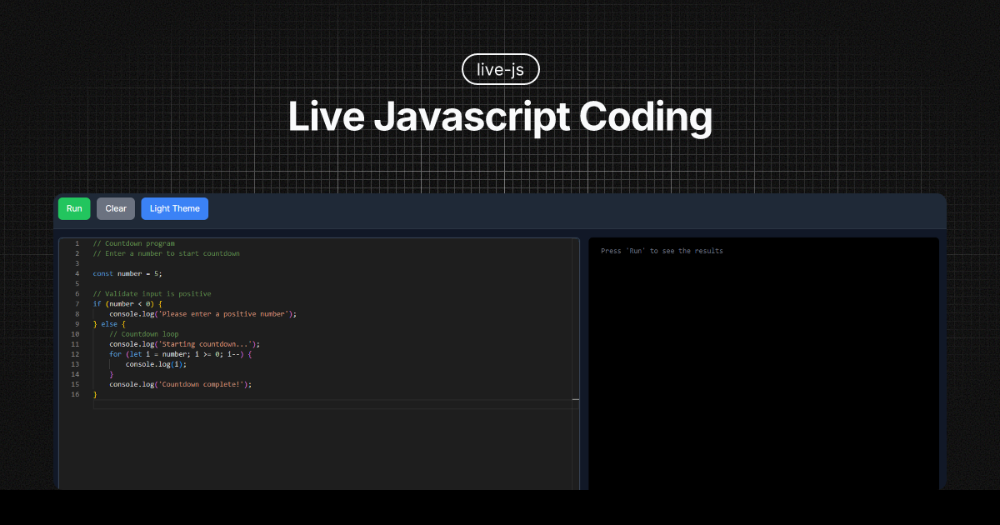

<div align="middle">

</div>

## 🌟 Live JS

A modern web application for writing, executing, and sharing JavaScript code in real-time with a minimalist and elegant interface.

### Code Editor
- **Monaco Editor** with complete JavaScript syntax highlighting
- **Line numbers** and cursor positioning
- **Real-time syntax validation**
- **Keyboard shortcuts** (Ctrl+Enter to execute)
- **Professional code editing experience**

### Interactive Execution
- **Node.js** for real-time JavaScript execution
- **Real-time output streaming** with live results
- **Error handling** with detailed stack traces
- **Execution timeout** to prevent infinite loops
- **Process isolation** for secure code execution

### User Interface
- **Responsive design** that adapts to any screen size
- **Split panel layout** (60% editor, 40% output)
- **Dark/Light themes** with automatic system detection
- **Smooth transitions** and elegant animations
- **Minimalist interface** focused on productivity

### Advanced Features
- **Save and share** code with unique URLs
- **Auto-save** in localStorage
- **Customizable settings** (font, theme, timeout)
- **Interactive console** with input prompts
- **Real-time collaboration** ready architecture

## 🛠️ Technologies

### Frontend
- **Nuxt 3** - Vue.js framework with SSR
- **Vue 3** - Reactive framework with Composition API
- **TypeScript** - Static typing for enhanced robustness
- **Tailwind CSS** - Utility-first CSS framework
- **Monaco Editor** - VS Code's editor for the web
- **Socket.io Client** - Real-time WebSocket communication

### Backend
- **Nitro** - Universal server engine
- **Node.js** - JavaScript runtime and execution engine
- **RESTful APIs** - Endpoints for saving and sharing code

### Development Tools
- **Bun** - Ultra-fast runtime and package manager
- **Vite** - Build tool with instant HMR
- **Git** - Version control
- **TypeScript** - Type-safe development

## 📦 Installation

### Prerequisites
- **Bun** 1.0+ (recommended) or **Node.js** 18+

### Installation Steps

1. **Clone the repository**
```bash
git clone https://github.com/zkjon/live-js.git
cd live-js
```

2. **Install dependencies**
```bash
bun install
```

3. **Run in development mode**
```bash
bun run dev
```

4. **Open in browser**
```
http://localhost:3000
```

## 🚀 Usage

### Writing Code
1. Write your JavaScript code in the left editor panel
2. Use **Ctrl+Enter** to execute or click the "Run" button
3. See real-time results in the right output panel

### Theme Switching
1. Click the "Light Theme" or "Dark Theme" button
2. The interface automatically adapts to your preference
3. Theme preference is saved locally

### Code Management
1. Click "Clear" to reset the editor
2. Code is automatically saved in your browser's local storage
3. Your work persists between sessions

## 🎨 Themes and Customization

### Available Themes
- **Light** - Minimalist theme with white background
- **Dark** - Elegant theme with dark background
- **Auto** - Automatically detects system preference

### Color System
- **Primary**: Green (#10B981)
- **Secondary**: Gray (#6B7280)
- **Success**: Green (#10B981)
- **Error**: Red (#EF4444)
- **Warning**: Yellow (#F59E0B)

## 📱 Responsive Design

The application is optimized for:
- **Desktop** (1024px+) - Horizontal split panel
- **Tablet** (768px-1023px) - Vertical split panel
- **Mobile** (320px-767px) - Stacked layout

## 🔧 Advanced Configuration

### Environment Variables
```env
# Server port
PORT=3000

# Execution timeout (seconds)
EXECUTION_TIMEOUT=30

# Node.js memory limit (MB)
NODE_MEMORY_LIMIT=128
```

## 🧪 Development

```bash
# Start development server
bun run dev

# Build for production
bun run build

# Preview production build
bun run preview
```

## 📈 Performance

### Performance Metrics
- **Initial load time**: < 2s
- **Code execution**: < 100ms (simple code)
- **Bundle size**: < 500KB (gzipped)
- **Real-time communication**: WebSocket-based

### Optimizations
- **Automatic code splitting**
- **Lazy loading** of components
- **Tree shaking** to eliminate unused code
- **Gzip/Brotli compression**
- **Intelligent asset caching**

## 🔒 Security

### Security Measures
- **JavaScript execution sandboxing**
- **Timeout** to prevent infinite loops
- **Memory and CPU limits**
- **Input/output sanitization**
- **Process isolation**
- **CORS** properly configured

### Limitations
- System module imports are restricted
- Limited file system access
- Execution in isolated environment

## 🤝 Contributing

1. **Fork** the repository
2. **Create** a feature branch (`git checkout -b feature/new-feature`)
3. **Commit** your changes (`git commit -am 'Add new feature'`)
4. **Push** to the branch (`git push origin feature/new-feature`)
5. **Open** a Pull Request

### Contribution Guidelines
- Follow existing code conventions
- Add tests for new features
- Update documentation when necessary
- Use descriptive and clear commits
- Use **Bun** as the package manager

## 📄 License

This project is licensed under the MIT License. See the [LICENSE](LICENSE) file for details.

## 🙏 Acknowledgments

- **Monaco Editor** for the excellent code editor
- **Nuxt Team** for the incredible framework
- **Tailwind CSS** for the utility-first styling
- **Socket.io** for real-time communication
- **Open Source Community** for the tools and libraries

## 📞 Support

Have questions or issues?

- 🐛 **Issues**: [GitHub Issues](https://github.com/zkjon/live-js/issues)
- 💬 **Discussions**: [GitHub Discussions](https://github.com/zkjon/live-js/discussions)
- 📖 **Documentation**: [Project Wiki](https://github.com/zkjon/live-js/wiki)

---

**Live JavaScript coding! ⚡✨**